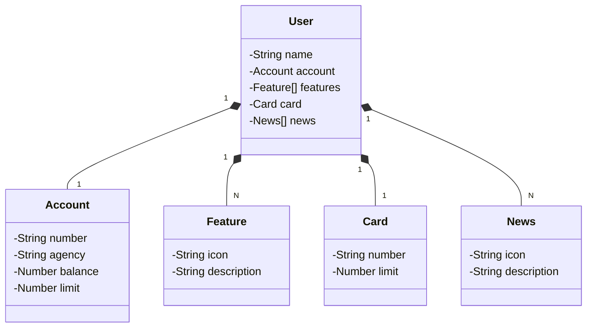

  <h1>RESTful-Java17-Spring-Railway <a href="https://restful-java17.up.railway.app/">Deploy</a></h1>

  <h2><a href="https://restful-java17.up.railway.app/swagger-ui/index.html">Documentation</a></h2>

### Techs Used

### Class Diagram (API Domain)

## Description

The Project is a RESTful API developed in Java 17, using Spring Boot 3 to ensure productivity and efficiency. By using Spring Data JPA, we facilitate access to data and integrate perfectly with PostgreSQL, a robust and reliable database. Additionally, API documentation is simplified with OpenAPI (Swagger), and cloud deployment and monitoring are streamlined by Railway. All this combined with the quality of the RESTful APIs provided by Spring Web.

## Main Technologies
- **Java 17**: I used Java version 17 to take advantage of the innovations that this robust and widely used language offers.
- **Spring Boot 3**: We will work with the newest version of Spring Boot, which maximizes developer productivity through its powerful self-configuration proposals;
- **Spring Web**: We will use Spring Web to create our RESTful APIs. It provides a comprehensive set of features for web development, including support for HTTP/2, WebSocket, and seamless integration with Spring MVC.
- **Spring Data JPA**: We will explore how this tool can simplify our data access layer, facilitating integration with SQL databases;
- **PostgreSQL**: We will use PostgreSQL as our relational database. It is a common choice due to its robustness, reliability, and advanced SQL capabilities.
- **OpenAPI (Swagger)**: We will create effective and easy-to-understand API documentation using OpenAPI (Swagger), perfectly aligned with the high productivity that Spring Boot offers;
- **Railway**: facilitates the deployment and monitoring of our cloud solutions, in addition to offering several databases as a service and CI/CD pipelines.

## Contributing

We welcome and appreciate your contributions to this project! Whether you have suggestions, bug fixes, or new features you'd like to add, please feel free to fork this repository.

### How to Contribute

1. Fork the project.
2. Create a branch for your contribution: `git checkout -b my-contribution`.
3. Make your changes and commit: `git commit -m 'Add my contribution'`.
4. Push to your branch: `git push origin my-contribution`.
5. Open a pull request for review.

## Feedback and Issues

If you have contributions, suggestions, or feedback, feel free to open an issue.
